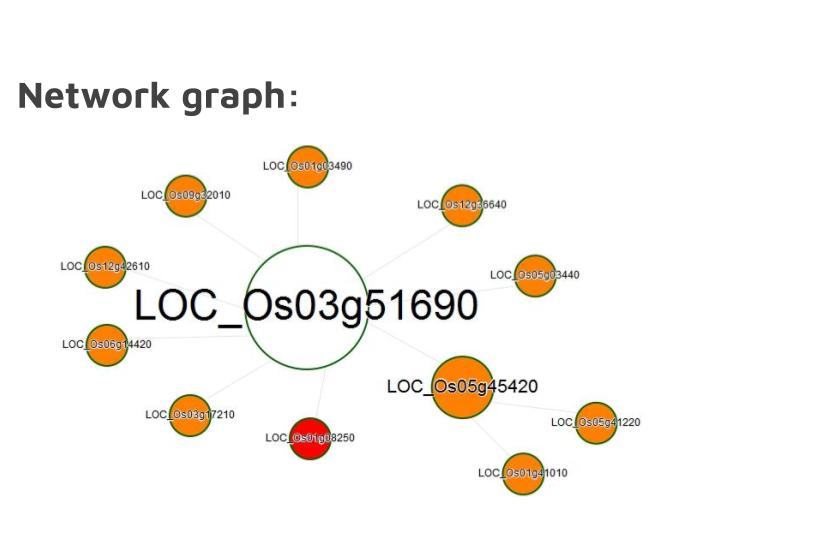

# Build Gene Regulatory Network From Multi Omics Data

## Contents
1. [Introduction](#introduction)
2. [Workflow](#workflow)
3. [Data Analysis](#data-analysis)
    * [Bioinformatics Tools](#bioinformatics-tools)
    * [ChIP-Seq Analysis](#chip-seq-analysis)
    * [RNA-Seq Analysis](#rna-seq-analysis)
    * [Build Gene Network](#build-gene-network)
    * [Cleanup](#cleanup)
4. [Results](#results)
5. [References](#references)

## Introduction
In contrast to animals that have completed their organ formation before birth, the plants continue to produce organs throughout their life cycle. The continuous formation of organs is very important to the plant development and growth; therefore understanding such feature can potentially improve the yield in many crop plants and benefit agriculture and food industry. 

	Shoot apical meristem (SAM) is responsible for the continous growth of plant organs. It 
is a region in a growing shoot consisting of self-renewing stem cells that can be transitioned into different specialized cell types such as leaf and flower cells, therefore playing an important part in the formation of aboveground organs/tissues [1]. 

The undifferentiated status of SAM is found to be maintained by Class I knotted1-like homeobox (KNOX) transcription factors. Studies have show that KNOX genes are specifically expressed in SAM, and the overexpression of KNOX in leaves would affect the leaf growth pattern while loss of KNOX genes would result in failure of SAM formation and maintenance[2]. KNOW were also found to be involved in regulating growth-promoting hormone cytokinin biosynthesis, as well as in regulating biosynthesis of cell wall components such as lignin and gibberellin [2]. Yet, we have not completely understood how the KNOX genes contribute to the maintenance of indeterminacy of SAM.

OSH1 is one of the KNOX transcription factors (TFs) in rice (Oryza sativa). OSH1 was found to regulate the signaling pathway of brassinosteroids, a group of hormones promoting differentiation in meristem cells [3]. To gather a better understanding of this KNOX gene function, I planned to run a genome-wide analysis of the OSH1 downstream pathway hoping to find a comprehensive set of target genes of OSH1 and build its gene regulatory network. 

## Workflow
To implement the genome-wide analysis, data from ChIP-Seq and RNA-Seq were used to build the gene network (Fig.1). The ChIP-Seq experiment consisted of two samples, one from chromatin immunoprecipitation of Japonica rice Nipponbare panicle sample using OSH1 antibody, and the other from the same  using rabbit IgG as negative control. Each sample had two biological replicates. As for the RNA-Seq experiment, DNA were extracted from  the wild-type leaf tissues and from the OSH1-overexpressing leaf tissues of the same rice line. Each treatment consisted of two biological replicates. [3]


The ChIP-seq raw data ( DRA000206 and DRA000313) were quality-controlled by FastQC, and aligned to the rice genome(MSU7.0) using Bowtie. MACS software was used for peak calling. The list of the nearest genes to the significant peaks were extracted using BEDTools. The list of genes, which were the potential targets of OSH1, was used for building the gene network. 

The RNA-Seq reads (DRA002287) were quality-controlled by FastQC and aligned to the rice genome (MSU7.0) using TopHat. Cufflinks was used to identify differentially expressed genes provided with a GFF3 annotation file. The output file of Cufflinks was used to build the gene network.

The gene regulatory network of OSH1 was generated using GeneNetworkBuilder (Bioconductor R),inputting the bound list identified by ChIP-Seq and the gene expression result. 

Additional scripts were written to format data in transition from one software to another, 

## Data Analysis

### Bioinformatics Tools

Tools: **bowtie2**, **macs14**, **bedtools**,**tophat2**.

Programming languages: **Perl**, **R**, **Bash**. 

Add all the bioinformatics tools to the class path, so they can be used without typing the full path.

### ChIP-Seq Analysis
1. Set working directory to the root directory of this repository.
2. Indexing the genome:

`$ bowtie2-build ./data/genome/rice_genome.fa genome/rice_genome`

3. Aligning the reads and output as .sam: 

```
$ bowtie2 -x rice_genome -1 osh1_1.fastq.bz2 -2 osh1_2.fastq.bz2 -S chipseq/osh1.sam
$ bowtie2 -x rice_genome -1 ctrl_1.fastq.bz2 -2 ctrl_2.fastq.bz2 -S chipseq/ctrl.sam
# No replicate, otherwise too much time consumption
```

4. Run MACS analysis using .sam as input files.

`$ macs14 -t ./data/chipseq/osh1.sam -c chipseq/ctrl.sam -f SAM -g 3.73e8 -n chipseq/chipseq`

5. Select peaks with FDR < 1% and fold-enrichment > 120

`$ ./code/chipseq/filter.pl`

6. BEDTool select the closest genes to the peaks:
```
#First, extract just gene annotations from all.gff3 file
$ awk '{if($3 ~ /gene/) print $0}' ./data/genome/all.gff3 > ./data/genome/genes.gff3
#Then sort the bed files because “bedtools closest” requires that all input files are presorted data by chromosome and then by start position (e.g., sort -k1,1 -k2,2n in.bed > in.sorted.bed for BED files).
$ sort -k 1,1 -k 2,2n ./data/chipseq/chipseq_peaks_filtered.bed > ./data/chipseq/sorted_peaks.bed
$ sort -k 1,1 -k 4,4n ./data/genome/genes.gff3 > ./data/genome/sorted_genes.gff3
# Then use “bedtools closest”
$ bedtools closest -io -a ./data/chipseq/sorted_peaks.bed -b ./data/genome/sorted_genes.gff3 > ./data/chipseq/nearest.out
```

### RNA-Seq Analysis
1. Index transcriptome:

`$ tophat2 -G ./data/genome/all.gff3 --transcriptome-index=./data/transcriptome/all_transcripts genome/rice_genome`

2. Tophat alignment:
```
$ tophat2 --transcriptome-index=./data/transcriptome/all_transcripts --library-type fr-secondstrand ./data/genome/rice_genome wt_rep1.fastq
$ tophat2 --transcriptome-index=./data/transcriptome/all_transcripts -o wt_rep2 -p6 --library-type fr-secondstrand ./data/genome/rice_genome wt_rep2.fastq
$ tophat2 --transcriptome-index=./data/transcriptome/all_transcripts -o osh1_rep1 -p6 --library-type fr-secondstrand ./data/genome/rice_genome osh1_rep1.fastq
$ tophat2 --transcriptome-index=./data/transcriptome/all_transcripts -o osh1_rep2 -p6 --library-type fr-secondstrand ./data/genome/rice_genome osh1_rep2.fastq
```

3. Cuffdiff to calculate differential gene expression:
```
$ cuffdiff -o ./data/cuffdiff_out ./data/transcriptome/all_transcripts.gff wt_rep1/accepted_hits.bam,wt_rep2/accepted_hits.bam osh1_rep1/accepted_hits.bam,osh1_rep2/accepted_hits.bam
```
4. Keep only the significantly differential expressions:
```
$ grep -i yes ./data/cuffdiff_out/gene_exp.diff > gene_exp_significant.diff
```
### Build Gene Network

1. Copy results of ChIP-Seq and RNA-Seq analyses to the current directory:
```
$ cp ./data/chipseq/nearest.out .
$ cp ./data/cuffdiff_out/gene_exp_significant.diff
```

2. Create the input of  OSH1-binding list, “bind_list.csv”, using the list of nearest genes to the peaks: 
```
$ /code/geneNetwork/create_bind_list.pl nearest.out
```

3. Create the input of the differential expression data, “exprdata.csv”, and remove infinite number:
```
$ create_expr_input.pl gene_exp_significant.diff
$ grep -v -i inf exprdata.csv > exprdata_temp.csv
$ mv exprdata_temp.csv exprdata.csv
```

4. Create dummy miRNA.map (not used, just beacuse it is GeneNetworkBuilder requirement)
5. Use experimentally verified protein-protein interactions from [here](http://bis.zju.edu.cn/prin/download.do)

6. Run the osh1_network.R (See “Results” section for the plots)

7. Extract function annotations of the downstream genes in the network:
```
$ perl ./code/geneNetwork/extract_targets.pl cifNetwork.csv ./data/genome/genes.gff3
```

### Cleanup

Remove `./data` folder

## Results



Figure 1. The OSH1-related genes interaction network. LOC_Os0351690 (center) is the ID of OSH1.


Figure 2. The network is plotted by interaction level (direct or indirect).


Table 1. The function annotations of the genes in the OSH1 network.
## References

[1] Steeves, T.A., and Sussex, I.M. (1989). Patterns in Plant Development. (Cambridge, UK: Cambridge University Press)

[2] Tsuda K, Ito Y, Sato Y, Kurata N. Positive Autoregulation of a KNOX Gene Is Essential for Shoot Apical Meristem Maintenance in Rice. The Plant Cell. 2011;23(12):4368-4381. doi:10.1105/tpc.111.090050.

[3] Tsuda K, Kurata N, Ohyanagi H, Hake S. Genome-Wide Study of KNOXRegulatory Network Reveals Brassinosteroid Catabolic Genes Important for Shoot Meristem Function in Rice. The Plant Cell. 2014;26(9):3488-3500. doi:10.1105/tpc.114.129122.